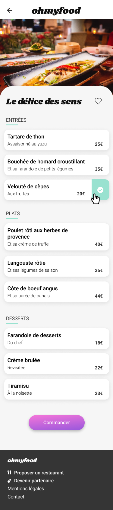

<h1>Site Ohmyfood</h1>

Projet 3 Openclassrooms - Dynamisez une page web avec des animations CSS

<h2>Contraintes techniques</h2>
<ul>
    <li>Le site est développé en mobile-first et devra s'adapter sur tablette et desktop</li>
    <li>Le développement devra se faire en CSS, sans JavaScript ni framework, en revanche l’utilisation de SASS serait un plus.</li>
</ul>

<h2>Livrables attendus</h2>
<h3>Contenu des pages</h3>
<h4>Page d'accueil (x1)</h4>
<ul>
    <li>Affichage de la localisation des restaurants. À terme il sera possible de choisir sa localisation pour trouver des restaurants proches d’un certain lieu.</li>
    <li>Une courte présentation de l’entreprise.</li>
    <li>Une section contenant les 4 menus sous forme cartes. Au clic sur la carte, l’utilisateur est redirigé vers la page du menu.</li>
</ul>

<h4>Pages de menu (x4)</h4>
<ul>
    <li>4 pages contenant chacune le menu d’un restaurant.</li>
</ul>

<h4>Footer</h4>
<ul>
    <li>Le footer est identique sur toutes les pages.</li>
    <li>Au clic sur “Contact”, un renvoi vers une adresse mail est effectué.</li>
</ul>

<h4>Header</h4>
<ul>
    <li>Le header est présent sur toutes les pages.</li>
    <li>Sur la page d’accueil, il contient le logo du site.</li>
    <li>Sur les pages de menu, il contient en plus un bouton de retour vers la page d’accueil.</li>
</ul>

<h3>Effets graphiques et animations</h3>
<h4>Boutons</h4>
<ul>
    <li>Au survol, la couleur de fond des boutons principaux devra légèrement s’éclaircir et l’ombre portée devra être plus visible.</li>
    <li>Au clic, le bouton "J’aime" en forme de cœur devra se remplir progressivement. Pour cette première version, l’effet peut être apparaître au survol sur desktop au lieu du clic.</li>
</ul>

<h4>Page d'accueil</h4>
<ul>
    <li>L'aperçu d'un loading spinner est demandé. Il devra apparaître pendant 1 à 3 secondes quand on arrive sur la page d'accueil, couvrir l'intégralité de l'écran, et utiliser les animations CSS (pas de librairie).</li>
</ul>

<h4>Pages de menu</h4>
<ul>
    <li>À l’arrivée sur la page, les plats devront apparaître progressivement avec un légerdécalage dans le temps.</li>
    <li>Lors de l'ajout de plat à la commande, une coche doit apparaître à la droite de l'intitulé. Cette coche devra coulisser de la droite vers la gauche. Pour cette première version, l’effet peut apparaître au survol sur desktop au lieu du clic. Si l’intitulé du plat est trop long, il devra être rogné avec des points de suspension.</li>
</ul>

<h2>Maquettes</h2>

